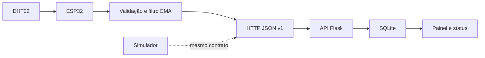

# Sentinela — PI V

[](https://github.com/pedrobragabes/univesp-pi5-sentinela/actions/workflows/ci.yml)
[](https://github.com/pedrobragabes/univesp-pi5-sentinela/actions/workflows/codeql.yml)
[](LICENSE)

Estação experimental de telemetria ambiental que integra **ESP32 + DHT22**, tratamento inicial do sinal, comunicação HTTP, ingestão autenticada, SQLite e painel responsivo.

O projeto é uma fundação para o **Projeto Integrador em Computação V (PJI510)** ou **Projeto Integrador Extensionista V**, conforme a matriz vigente na matrícula. Ele cobre o núcleo comum dos PPCs de 2025 e 2026: integração hardware/software, sistemas embarcados, aquisição e tratamento de dados, comunicação, conectividade, interface, testes e controle de versão.

> **Limite de validação:** o firmware compila para a placa `esp32dev`, o protocolo e o serviço foram testados com simulador, mas nenhum ESP32 ou sensor físico foi conectado nesta etapa. Montagem, calibração, consumo e ensaio de campo permanecem pendentes e não são apresentados como concluídos.

## Estado

| Dimensão | Situação |
|---|---|
| fundação de software | concluída, com 6 testes Python, testes C++ e build ESP32 na CI |
| versão | `v0.1.0-foundation` |
| hardware | bloqueado: nenhuma placa ESP32 foi detectada nesta estação de trabalho |
| entrega acadêmica | pendente de parceiro, bancada, calibração, ensaio, relatório e vídeo |

## Entrega técnica atual

- firmware Arduino para ESP32 com leitura DHT22 a cada 30 segundos;
- rejeição de valores fisicamente inválidos;
- média móvel exponencial, com `alpha = 0,25`, aplicada no dispositivo;
- sincronização UTC por NTP e reconexão Wi-Fi;
- mensagem JSON versionada com identificação de boot e sequência;
- receptor Flask autenticado por chave de dispositivo;
- validação estrita, janela temporal e deduplicação no SQLite;
- estado online/sem sinal e últimas leituras no painel;
- simulador determinístico para testar o sistema sem hardware;
- testes Python, testes nativos da lógica C++ e build ESP32 na CI.

## Arquitetura



## Executar o serviço no Windows

Requer Python 3.14.

```powershell
python -m venv .venv
.\.venv\Scripts\python.exe -m pip install -r requirements.txt
$env:SENTINELA_DEVICE_KEY = "uma-chave-local-forte"
.\.venv\Scripts\python.exe -m sentinela.web
```

Em outro terminal:

```powershell
$env:SENTINELA_DEVICE_KEY = "uma-chave-local-forte"
.\.venv\Scripts\python.exe simulator\send_readings.py --count 8
```

Abra `http://127.0.0.1:3004`.

## Compilar o firmware

```powershell
.\.venv\Scripts\python.exe -m pip install -r requirements-dev.txt
Copy-Item firmware\include\local_config.example.h firmware\include\local_config.h
# edite local_config.h com a rede, URL, chave e identificação da bancada
.\.venv\Scripts\pio.exe run -d firmware -e esp32dev
```

O `local_config.h` contém segredos locais e é ignorado pelo Git. O perfil sem esse arquivo existe apenas para permitir a compilação da CI; suas credenciais de exemplo não devem ser implantadas.

## Testes

```powershell
.\.venv\Scripts\python.exe -m unittest discover -s tests -v
.\.venv\Scripts\python.exe -m pip check
.\.venv\Scripts\pio.exe test -d firmware -e native
.\.venv\Scripts\pio.exe run -d firmware -e esp32dev
```

O teste nativo C++ exige `gcc/g++` no computador. A CI executa essa etapa no Linux. Neste Windows, foram aprovados 6 testes Python e a compilação ESP32; o teste C++ local ficou indisponível por ausência do compilador nativo.

## Estrutura

```text
firmware/    código embarcado, configuração e testes C++
sentinela/   validação, persistência, API e painel
simulator/   emissor de telemetria sem hardware
templates/   interface renderizada no servidor
static/      estilos responsivos
tests/       testes de protocolo e integração
docs/        contrato, montagem, validação e revisão
```

## Segurança e implantação

A demonstração usa HTTP local. Não envie a chave nem telemetria por uma rede não confiável. Uma implantação externa deve usar HTTPS, segredo exclusivo por dispositivo, rotação de credenciais, limite de requisições, servidor WSGI e backup do banco. O protótipo não é certificado e não deve controlar cargas nem apoiar decisões de saúde ou segurança.

## Próximos passos acadêmicos

1. confirmar PJI V ou PIE V no AVA;
2. selecionar parceiro, local e fenômeno relevante;
3. comprar ou confirmar os componentes;
4. montar em baixa tensão e executar o [plano de validação física](docs/03-validacao-fisica.md);
5. registrar evidências reais de bancada e devolutiva;
6. produzir relatório e vídeo conforme o calendário da disciplina.

Consulte também o [contrato de telemetria](docs/01-protocolo.md), o [guia de montagem](docs/02-montagem.md), o [plano de validação física](docs/03-validacao-fisica.md), a [revisão de código](docs/04-revisao-de-codigo.md), o [modelo de relatório parcial](docs/05-relatorio-parcial.md) e o [modelo de relatório final](docs/06-relatorio-final.md).

## Governança e licença

As atividades devem ser acompanhadas por issues e milestones alinhados ao AVA. Consulte [SECURITY.md](SECURITY.md). Código e firmware usam [licença MIT](LICENSE); medições e evidências do parceiro exigem autorização própria.
