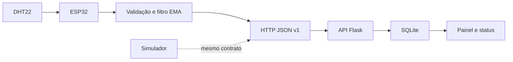

# Sentinela — PI V

[](https://github.com/pedrobragabes/univesp-pi5-sentinela/actions/workflows/ci.yml)
[](https://github.com/pedrobragabes/univesp-pi5-sentinela/actions/workflows/codeql.yml)
[](LICENSE)

Estação experimental de telemetria ambiental que integra **ESP32 + DHT22**, tratamento inicial do sinal, comunicação HTTP, ingestão autenticada, SQLite e painel responsivo.

O projeto é uma fundação para o **Projeto Integrador em Computação V (PJI510)** ou **Projeto Integrador Extensionista V**, conforme a matriz vigente na matrícula. Ele cobre o núcleo comum dos PPCs de 2025 e 2026: integração hardware/software, sistemas embarcados, aquisição e tratamento de dados, comunicação, conectividade, interface, testes e controle de versão.

> **Limite de validação:** o firmware compila para a placa `esp32dev`, o protocolo e o serviço foram testados com simulador, mas nenhum ESP32 ou sensor físico foi conectado nesta etapa. Montagem, calibração, consumo e ensaio de campo permanecem pendentes e não são apresentados como concluídos.

## Estado

| Dimensão | Situação |
|---|---|
| fundação de software | revisada, com 17 testes Python, 7 casos C++, 9 testes de navegador e build ESP32 na CI |
| versão | `0.1.1` (revisão técnica; sem validação física) |
| hardware | bloqueado: nenhuma placa ESP32 foi detectada nesta estação de trabalho |
| entrega acadêmica | pendente de parceiro, bancada, calibração, ensaio, relatório e vídeo |

## Entrega técnica atual

- firmware Arduino para ESP32 com ciclo de 30 segundos; a aquisição pausa enquanto há uma leitura aguardando confirmação;
- rejeição de valores fisicamente inválidos;
- média móvel exponencial, com `alpha = 0,25`, aplicada no dispositivo;
- sincronização UTC por NTP e reconexão Wi-Fi;
- mensagem JSON versionada com identificação de boot e sequência;
- receptor Flask autenticado por chave de dispositivo;
- validação estrita, janela temporal e repetição idempotente no SQLite; dados diferentes com a mesma identidade recebem HTTP 409;
- estado de entrega online/sem sinal, idade da observação e relógio adiantado no painel; a observação mais recente prevalece sobre entregas atrasadas;
- simulador determinístico para testar o sistema sem hardware;
- testes Python, testes nativos da lógica C++ e build ESP32 na CI.

## Arquitetura


```mermaid
flowchart LR
    A["DHT22"] --> B["ESP32"]
    B --> C["Validação e filtro EMA"]
    C --> D["HTTP JSON v1"]
    D --> E["API Flask"]
    E --> F["SQLite"]
    F --> G["Painel e status"]
    H["Simulador"] -. "mesmo contrato" .-> D
```

## Executar o serviço no Windows

Requer Python 3.14.

```powershell
python -m venv .venv
.\.venv\Scripts\python.exe -m pip install -r requirements.txt
$env:SENTINELA_DEVICE_KEY = "uma-chave-local-forte"
.\.venv\Scripts\python.exe -m sentinela.web
```

Em outro terminal:

```powershell
$env:SENTINELA_DEVICE_KEY = "uma-chave-local-forte"
.\.venv\Scripts\python.exe simulator\send_readings.py --count 8
```

Abra `http://127.0.0.1:3004`.

## Compilar o firmware

```powershell
.\.venv\Scripts\python.exe -m pip install -r requirements-dev.txt
Copy-Item firmware\include\local_config.example.h firmware\include\local_config.h
# edite local_config.h com a rede, URL, chave e identificação da bancada
.\.venv\Scripts\pio.exe run -d firmware -e esp32dev
```

O `local_config.h` contém segredos locais e é ignorado pelo Git. O perfil sem esse arquivo existe apenas para permitir a compilação da CI; suas credenciais de exemplo não devem ser implantadas.

## Testes

```powershell
.\.venv\Scripts\python.exe -m unittest discover -s tests -v
.\.venv\Scripts\python.exe -m pip check
.\.venv\Scripts\python.exe -m compileall -q sentinela simulator scripts tests
.\.venv\Scripts\pio.exe test -d firmware -e native
.\.venv\Scripts\pio.exe run -d firmware -e esp32dev
```

O teste nativo C++ exige `gcc/g++`; sua execução fica na CI Linux. Neste Windows passaram 17 testes Python e o build ESP32 (47.380 bytes de RAM e 927.885 bytes de aplicação). O compilador nativo continua ausente. Os 7 casos C++ incluem confirmação JSON correlacionada e preservação do mesmo corpo após perda da resposta.

Para verificar o painel, instale Node.js 22 ou superior e as dependências Python acima:

```powershell
npm ci
npx playwright install chromium
npm run test:e2e
```

Os 9 testes cobrem três larguras (1440, 390 e 320 px), estados recente/antigo/sem sinal/relógio adiantado, navegação sem JavaScript e foco por teclado. As seis análises Axe dos estados preenchido/vazio não tiveram violações. A fixture usa somente dados sintéticos em banco temporário e escuta em `127.0.0.1:3486`.

## Estrutura

```text
firmware/    código embarcado, configuração e testes C++
sentinela/   validação, persistência, API e painel
simulator/   emissor de telemetria sem hardware
templates/   interface renderizada no servidor
static/      estilos responsivos
tests/       testes de protocolo e integração
docs/        contrato, montagem, validação e revisão
```

## Limites de retransmissão

O dispositivo mantém **uma leitura imutável em RAM** e repete exatamente o mesmo JSON até receber HTTP 201/`accepted` ou HTTP 200/`duplicate`, com `id`, dispositivo, boot e sequência correspondentes. Um HTTP 200 genérico, JSON inválido, resposta de outra sequência ou HTTP 409 não libera a leitura. Enquanto ela está pendente não são adquiridas novas amostras nem atualizado o filtro: a cadência de aquisição fica menor durante indisponibilidade.

A memória não sobrevive a reinicializações; uma fila persistente continua pendente. Uma leitura nova com mais de 24 horas é rejeitada; uma repetição idêntica de uma leitura já armazenada pode ser confirmada após essa janela. Um conflito ou rejeição permanente exige investigar o contrato/configuração antes de reiniciar, registrando a perda da leitura pendente. O painel calcula `online` pela última entrega **armazenada** há até 120 s; isso não prova conexão contínua nem qualidade da medição.

## Segurança e implantação

A demonstração usa HTTP local. Não envie a chave nem telemetria por uma rede não confiável. Uma implantação externa deve usar HTTPS, segredo exclusivo por dispositivo, rotação de credenciais, limite de requisições, servidor WSGI e backup do banco. O protótipo não é certificado e não deve controlar cargas nem apoiar decisões de saúde ou segurança.

## Próximos passos acadêmicos

1. confirmar PJI V ou PIE V no AVA;
2. selecionar parceiro, local e fenômeno relevante;
3. comprar ou confirmar os componentes;
4. montar em baixa tensão e executar o [plano de validação física](docs/03-validacao-fisica.md);
5. registrar evidências reais de bancada e devolutiva;
6. produzir relatório e vídeo conforme o calendário da disciplina.

Consulte também o [contrato de telemetria](docs/01-protocolo.md), o [guia de montagem](docs/02-montagem.md), o [plano de validação física](docs/03-validacao-fisica.md), a [revisão de código](docs/04-revisao-de-codigo.md), o [modelo de relatório parcial](docs/05-relatorio-parcial.md) e o [modelo de relatório final](docs/06-relatorio-final.md).

## Governança e licença

As atividades devem ser acompanhadas por issues e milestones alinhados ao AVA. Consulte [SECURITY.md](SECURITY.md). Código e firmware usam [licença MIT](LICENSE); medições e evidências do parceiro exigem autorização própria.
